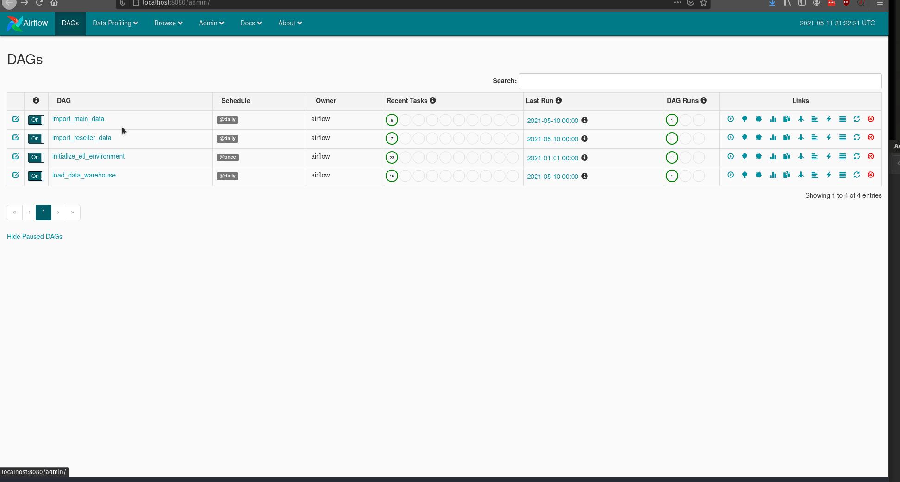
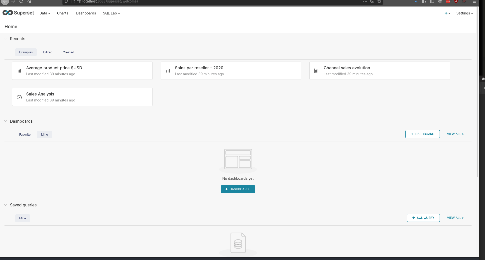

# Demo Docker-Based Business Intelligence Suite

This application is a Business Intelligence suite for an imaginary company selling postcards. The company sells both directly but also through resellers in the majority of European countries.

## Setup

### Requirements
* [Docker](https://docs.docker.com/engine/install/)
* [Docker-Compose](https://docs.docker.com/compose/install/)

With **Docker engine** and **Docker-Compose** installed, change directory to the root folder of the project (also the one that contains docker-compose.yml) and run

`
docker-compose up --build
`

### Demo Credentials

Demo credentials are set in the .env file, and are by default the following:
* POSTGRES_USER=postgres
* POSTGRES_PASSWORD=postgres
* SUPERSET_ADMIN=admin
* SUPERSET_PASSWORD=admin

### Ports exposed locally
* Airflow: 8080
* Superset: 8088
* PostgreSQL Data Warehouse: 54321
* PosgreSQL OLTP Database: 54320

Generated flat files (XML, CSV) are saved in the **import** folder.

### General flow

1. Generate test data (flat files + OLTP data) using Python
2. Import flat file data and OLTP data to staging area in the Data Warehouse, orchestrated by Airflow
3. Process data, build fact and dimension tables, load the Data Warehouse
4. Analyze and visually explore the data using Superset or directly query the Data Warehouse instance

## Overview of architecture

The docker-compose process will begin building the application suite. The suite is made up of the following components, each within its own docker container:
* **generator**: this is a collection of Python scripts that will generate, insert and export the example data
* **oltp**: this is the PostgreSQL instance that will simulate our transactional database (**sales_oltp**), serving as one of the sources of the data; this is locally available on the host machine exposed on port 54320.
* **airflow**: this is the orchestrator tool that will trigger the ETL tasks; its GUI is locally available on port 8080; 
* **airflowdb**: this is a PosgreSQL instance, upon which airflow depends
* **dw**: this is a PostgreSQL instance that will host our Data Warehouse; locally available on port 54321 (database **sales_dw**).
* **superset**: this contains the web-based Business Intelligence application we will use to explore the data; exposed on port 8088.

Once the docker-compose building process has completed, we may open the Airflow GUI (locally: port 8080) to view the orchestration of our tasks. There are four defined workflows (known as DAGs in Airflow), as follows:
- **initialize_etl_environment**: this workflow initializes the ETL environment by creating the necessary database objects; this needs to run only once;
- **import_main_data** : this imports the data from the transactional system to a destination on the DW instance
- **import_reseller_data**: this workflow extracts, preprocesses and loads the XML and CSV data sent by the resellers
- **load_data_warehouse**: this workflow transforms the data from transactional and flat-file sources, stores them in a staging area and loads the data warehouse

After the DAGs have completed you can either analyze the data using the querying and visualization tools provided by Superset (available locally on port 8088), or query the Data Warehouse (available locally on port 54321)

