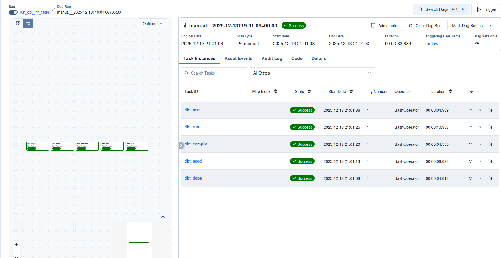
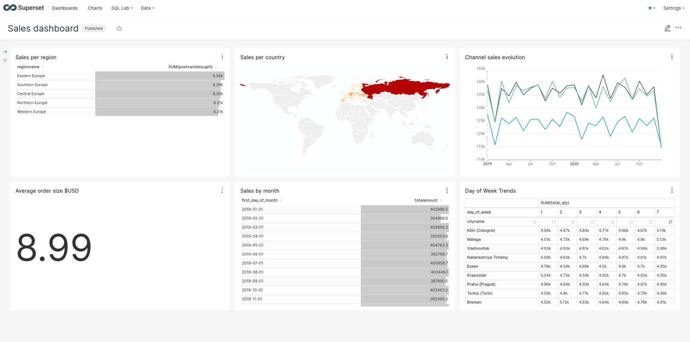

# Portable Airflow Data Stack

This application is an Analytics suite suite for an imaginary company selling postcards. The company sells both directly but also through resellers in the majority of European countries.

## Stack

- Airflow
- Docker (Docker Compose)
- DuckDB
- dbt core
- Superset

## Interested in the data model?

Generation of example data and the underlying dbt-core model is available in the [postcard-company-datamart](https://github.com/cnstlungu/postcard-company-datamart) project

## For implementations using other tools, using the same data model, check the below:

- [portable-data-stack-mage](https://github.com/cnstlungu/portable-data-stack-mage)
- [portable-data-stack-dagster](https://github.com/cnstlungu/portable-data-stack-dagster)
- [portable-data-stack-sqlmesh](https://github.com/cnstlungu/portable-data-stack-sqlmesh)

Implementations not using the same dbt-core model:

- [portable-data-stack-bruin](https://github.com/cnstlungu/portable-data-stack-bruin)

The Airflow / docker-compose setup is based on the [official Airflow docker-compose example](https://airflow.apache.org/docs/apache-airflow/stable/howto/docker-compose/index.html#fetching-docker-compose-yaml)

## Setup

1. Rename `.env.example` file to `.env` and set your desired credentials. Remember to never commit files containing passwords or any other sensitive information.

2. Rename `shared/db/datamart.duckdb.example` to `shared/db/datamart.duckdb` or init an empty database file there with that name.

3. With **Docker Engine** installed, change directory to the root folder of the project (also the one that contains docker-compose.yml) and run

    `docker compose up --build`

    Note that this may take several minutes to completed. Check out the console to see when the Airflow interface is ready.

4. Once the Docker suite has finished loading, open up [Airflow](http://localhost:8080) and execute one of the DAGs:

- `run_dbt_individual_models` - this will run the dbt models one by one
- `run_dbt` - this will run the dbt models in a single run

Note that given the way DuckDB works, the run_dbt_individual_models will run each task sequentially, potentially taking a few minutes to go through all of them.

5. After the successful processing of the DAGs, you can either analyze the data using the querying and visualization tools provided by Superset (available locally on port 8088), or query the Data Warehouse by connecting to the DuckDB database file found in the `shared/db/datamart.duckdb` file.

### Demo Credentials

Demo credentials are set in the .env file mentioned above. For Airflow they are by default the following:

* AIRFLOW_USER=airflow
* AIRFLOW_PASSWORD=airflow

For Superset they are by default the following:

* SUPERSET_USER=admin
* SUPERSET_PASSWORD=admin

### Ports exposed locally
* Airflow: 8080
* Superset: 8088

### General flow

1. Generate test data as parquet files using Python

> **_NOTE:_**  The data is fictional and automatically generated. Any similarities with existing persons, entities, products or businesses are purely coincidental.

2. Import data to the staging area in the Data Warehouse (DuckDB)
3. Model data, build fact and dimension tables, load the Data Warehouse using dbt core
    - installs dbt dependencies
    - seeds the database with static data (e.g. geography)
    - runs the model
    - tests the model
4. Analyze and visually explore the data using Superset or directly query the Data Warehouse database instance

## Overview of architecture

The docker process will begin building the application suite. The suite is made up of the following services, each within its own docker container:
* **generator**: this is a Python script that will generate, insert and export the example data to parquet files
* **airflow**: this is the orchestrator tool that will trigger the ETL tasks; its GUI is locally available on port 8080; 
* **superset**: this contains the web-based Business Intelligence application we will use to explore the data; exposed on port 8088.

After the DAGs have completed you can either analyze the data using the querying and visualization tools provided by Superset (available locally on port 8088), or query the Data Warehouse by connecting to the DuckDB database file found in the `shared/db/datamart.duckdb` file.

